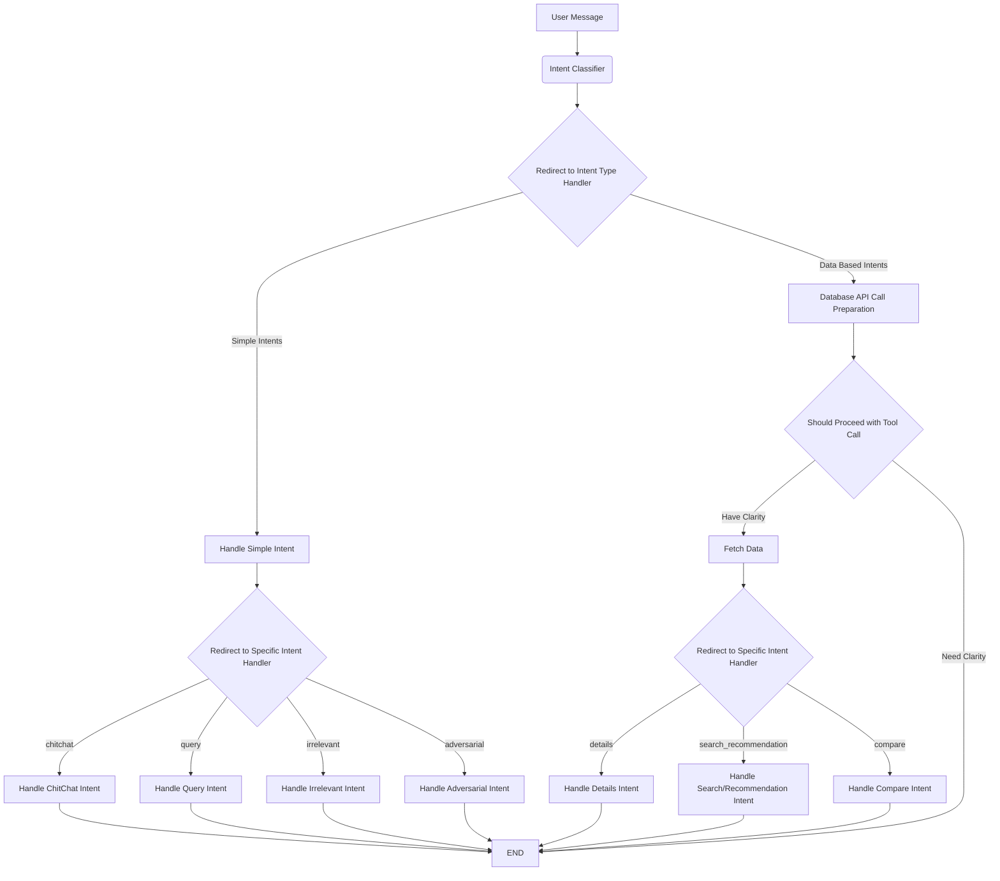

# Mobile Shopping Assistant Chatbot

This project is a production-grade chatbot designed to assist users with phone recommendations and answer their queries. It features a user-friendly interface and a robust backend powered by modern technologies.

[](https://mobile-shopping-chat-assistant.vercel.app/)

## Motivation

The primary motivation behind this project is to create a reliable and intelligent chatbot that can provide accurate and helpful information about mobile phones. In a market flooded with numerous options, this chatbot aims to simplify the decision-making process for users by offering personalized recommendations based on their needs and preferences.

## Tech Stack and Architecture

### Frontend

- **Framework:** React with Vite
- **Language:** TypeScript
- **Styling:** Tailwind CSS
- **UI Components:** Lucide React
- **Dependencies:** Supabase Client, React Markdown

### Backend

- **Framework:** FastAPI
- **Language:** Python
- **AI/ML:** LangChain, LangGraph, Google Generative AI
- **Database:** Supabase
- **API:** RESTful API with Pydantic models
- **Server:** Uvicorn

### Backend Architecture: A Deep Dive with LangGraph

The chatbot's intelligence is powered by a sophisticated multi-agent system built with `langgraph`. This framework allows us to define the agent's logic as a state graph, providing a clear, modular, and maintainable structure.

#### The State Graph

The core of our backend is a state graph that processes user messages. Each node in the graph represents a step in the agent's reasoning process, and the edges dictate the flow of logic. The state of the graph, `AgentState`, is passed between nodes and contains the message history, the user's intent, the AI's response, and any data retrieved from tools.

#### Key Nodes and Their Roles

1.  **Intent Classifier:** This is the entry point of the graph. It uses a Google Generative AI model to classify the user's intent into one of several categories (e.g., `search_recommendation`, `chitchat`, `adversarial`).

2.  **Conditional Router:** Based on the classified intent, this node routes the logic to the appropriate handler. Simple intents like `chitchat` are handled by dedicated nodes, while more complex, data-driven intents are routed to a tool-calling pipeline.

3.  **Database API Call Preparation:** For data-driven intents, this node prepares the necessary tool calls. It determines which tools to use (e.g., `fetch_phone_details`, `fetch_recommendations`) and what parameters to pass.

4.  **Tool Node:** This node, provided by `langgraph`, executes the prepared tool calls. It interacts with our Supabase database to fetch phone details, recommendations, or comparisons.

5.  **Intent Handlers:** A series of nodes, each responsible for handling a specific intent. These nodes generate the final response to the user, incorporating any data retrieved from the tools.

#### Conditional Edges: The Logic of the Graph

The power of `langgraph` lies in its use of conditional edges, which allow for dynamic routing based on the current state. For example:

*   After intent classification, a conditional edge checks whether the intent is "simple" or "data-based" and routes accordingly.
*   After the tool preparation node, another conditional edge checks if a tool call is necessary. If not, the graph can exit early.

This modular and stateful approach allows for a highly flexible and powerful agent that can handle a wide range of user queries with a clear and debuggable logic flow.

#### Architecture Diagram



## Features

- **Personalized Recommendations:** Get phone recommendations based on your specific needs and preferences.
- **Natural Language Understanding:** Interact with the chatbot using natural language, just like you would with a human.
- **Real-time Responses:** Receive instant responses to your queries, ensuring a seamless user experience.
- **User-Friendly Interface:** The intuitive and responsive design makes it easy to interact with the chatbot.

## Project Structure

```
.
├── backend/            # Python/FastAPI backend
│   ├── agent/          # Core LangGraph agent logic
│   │   ├── graph.py    # Defines the LangGraph state graph
│   │   ├── state.py    # Defines the AgentState
│   │   └── tools/      # Tools for the agent to use (e.g., database access)
│   ├── api/            # FastAPI routes and models
│   │   ├── routes.py   # API endpoint definitions
│   │   └── models.py   # Pydantic models for request/response
│   ├── core/           # Core application logic
│   │   ├── config.py   # Configuration settings
│   │   └── session_manager.py # Manages user chat sessions
│   ├── main.py         # FastAPI application entry point
│   └── requirements.txt
└── frontend/           # React/TypeScript frontend
    ├── src/
    │   ├── App.tsx     # Main application component
    │   ├── components/ # Reusable UI components
    │   ├── services/   # API communication layer
    │   └── config/     # Frontend configuration
    ├── index.html
    ├── package.json
    └── vite.config.ts
```

## API Endpoints

### POST /api/v1/chat

Processes a chat message and returns the AI's response.

**Request Body:**

- `message` (string, required): The user's message.
- `session_id` (string, optional): The session ID for conversation continuity.

**Response Body:**

- `session_id` (string): The session ID for the conversation.
- `intent` (string): The classified intent of the message.
- `response` (string): The AI's response.
- `context_data` (object): Additional context data.
- `timestamp` (string): The response timestamp.

### POST /api/v1/sessions/new

Creates a new chat session.

**Response Body:**

- `session_id` (string): The new session ID.
- `message` (string): A success message.

### DELETE /api/v1/sessions/{session_id}

Deletes a chat session.

### GET /api/v1/sessions/{session_id}/history

Retrieves the conversation history for a session.

## Setup and Installation

### Prerequisites

- Node.js and npm
- Python 3.9+ and pip
- Git

### Installation

1. **Clone the repository:**
   ```bash
   git clone https://github.com/developer-kulbhushan/mobile-shopping-chat-agent.git
   cd phone-assistant-chatbot
   ```

2. **Backend Setup:**
   ```bash
   cd backend
   pip install -r requirements.txt
   ```

3. **Frontend Setup:**
   ```bash
   cd frontend
   npm install
   ```

### Environment Variables

Create a `.env` file in the `backend` directory and add the following:

```
GOOGLE_API_KEY="your-google-api-key"
SUPABASE_URL="your-supabase-url"
SUPABASE_KEY="your-supabase-key"
```

Create a `.env` file in the `frontend` directory and add the following:

```
VITE_API_BASE_URL="http://localhost:8000/api/v1"
```

### Running the Application

1.  **Backend:**
    Navigate to the `backend` directory and run the following command to start the development server:
    ```bash
    uvicorn main:app --reload
    ```
    The backend will be available at `http://localhost:8000`.

2.  **Frontend:**
    Navigate to the `frontend` directory and run the following command to start the development server:
    ```bash
    npm run dev
    ```
    The frontend will be available at `http://localhost:5173`.

## Prompt Design and Safety

The chatbot's effectiveness and safety are paramount. We have implemented the following strategies to ensure a reliable and secure user experience:

- **Persona-Based Prompts:** The chatbot is designed with a specific persona to maintain a consistent tone and style in its responses.
- **Contextual Understanding:** The prompts are designed to provide the chatbot with the necessary context to understand user queries accurately.
- **Guardrails and Filters:** We have implemented safety filters and guardrails to prevent the chatbot from generating inappropriate or harmful content.

## Known Limitations

- **Limited Knowledge Base:** The chatbot's knowledge is limited to the data it was trained on. It may not be able to answer queries about very new or niche phone models.
